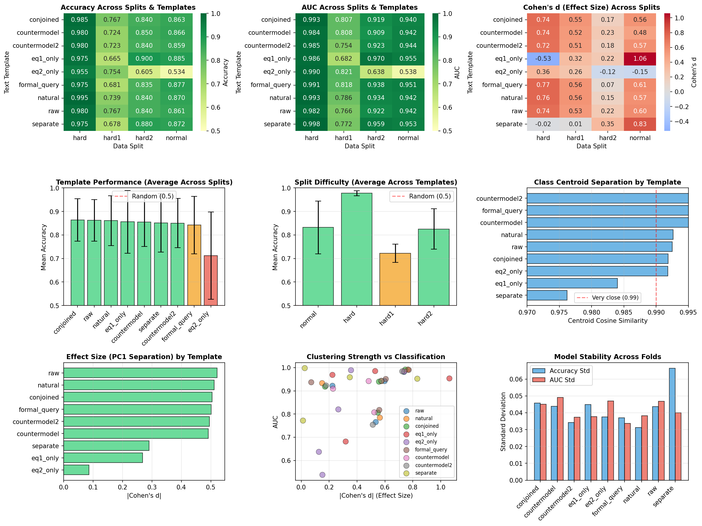

# SAIR Mathematics Distillation Challenge - Equational Theories

Do TRUE and FALSE mathematical implications cluster differently in sentence embedding space?

An exploration on the [SAIR Mathematics Distillation Challenge](https://competition.sair.foundation/competitions/mathematics-distillation-challenge-equational-theories-stage1/data) using the [equational_theories](https://github.com/teorth/equational_theories?tab=readme-ov-file) dataset, which contains mathematical implications labeled as TRUE or FALSE.

---

## Setup

```bash
# Clone the repo
git clone <repo-url>
cd sair-competition-exploration

# Create and activate a virtual environment
python -m venv venv
# Windows
venv\Scripts\activate
# macOS/Linux
source venv/bin/activate

# Install dependencies
pip install -r requirements.txt
```

---

## Data

The dataset is in `data/SAIR-competition/` and contains four splits:

| File | Description |
|------|-------------|
| `normal.jsonl` | Standard train/test split |
| `hard.jsonl` | Harder split |
| `hard1.jsonl` | Hard variant 1 |
| `hard2.jsonl` | Hard variant 2 |

---

## Scripts

### `sair_experiment.py` — Main pipeline

Embeds implications with a sentence-transformer model, then clusters and classifies them to test whether TRUE/FALSE implications land in geometrically distinct regions of embedding space.

```bash
# Full pipeline on the normal split (embed → cluster → classify → plot)
python sair_experiment.py --data normal --steps embed cluster classify plot

# Embed and cache first (expensive), analyse later
python sair_experiment.py --data normal --steps embed
python sair_experiment.py --data normal --steps cluster classify plot

# Compare all text templates on the hard split
python sair_experiment.py --data hard --template all --steps embed cluster classify plot

# Run on every split, natural language template, skip plots
python sair_experiment.py --data all --template natural --steps embed cluster classify

# Use a different sentence-transformers model
python sair_experiment.py --data normal --model all-mpnet-base-v2 --steps embed cluster classify plot
```

**Key arguments:**

| Argument | Default | Description |
|----------|---------|-------------|
| `--data` | `normal` | Split to use: `normal`, `hard`, `hard1`, `hard2`, or `all` |
| `--template` | `raw` | Text template: `raw`, `natural`, `conjoined`, `eq1_only`, `eq2_only`, `formal_query`, `countermodel`, `countermodel2`, or `all` |
| `--model` | `all-MiniLM-L6-v2` | Any `sentence-transformers` model name |
| `--steps` | `embed cluster classify plot` | Pipeline steps to run |

Embeddings are cached under `cache/sair/` so re-runs skip the encoding step.
Results are written to `results/sair/`.

---

### `visualize_results.py` — Plot results

Generates heatmaps, line plots, and scatter plots from `results/sair/cluster_results.csv` and `results/sair/classify_results.csv`.

```bash
python visualize_results.py
```

---

## Results



---

## Typical workflow

```bash
# 1. Run the full experiment on all splits and templates
python sair_experiment.py --data all --template all --steps embed cluster classify plot

# 2. Run rigorous controls
python sair_rigorous.py --checks all --split normal

# 3. Visualize aggregated results
python visualize_results.py
```
